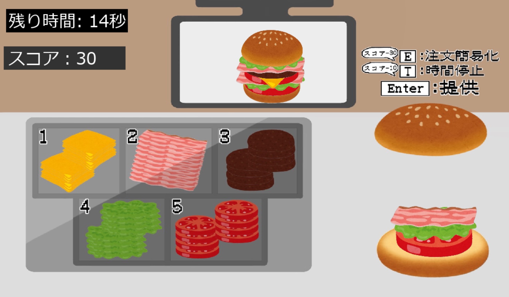

# ハンバーガー屋さん

## 実行環境の必要条件
* python >= 3.10
* pygame >= 2.1

## ゲームの概要
* 注文通りのハンバーガーを正確に作ろう!

## ゲームの遊び方
* 表示されたハンバーガーの画像と同じ順番のバーガーを作る（材料に対応する数字キーを押す）
* 完成したらEnterキーで商品を提供（間違えても消せない）
* 合っていたらスコア「プラス10」間違えたら「マイナス10」される
* Eキーを押すと3秒間簡単なメニューだけ来る（スコアを30消費）
* Tキーを押すと10秒間時間が停止する（スコアを10消費）
* 制限時間内に獲得したスコアでランクが決まる

## ゲームの実装
### 共通基本機能
* 背景画像と主人公キャラクター、材料の描画
* メニューリストを作る
* クリックした材料を積み上げていく(重ねて描画していく)
* 完成したら客に渡す
### 分担追加機能
* 制限時間【鉢窪華】
* スコア:注文通りに作れたらプラス、ミスしたらマイナス【福山鈴華】
* スキル１：時間停止【秋山莉月】
* スキル２：注文が簡単になる(1種類しか注文が来なくなる)【戸澤亜依美】
* スコアに応じてエンディングが変わる【三原更紗】
* 効果音追加【林れいな】

